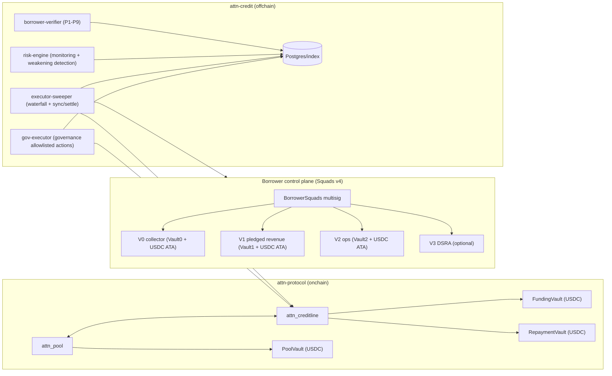
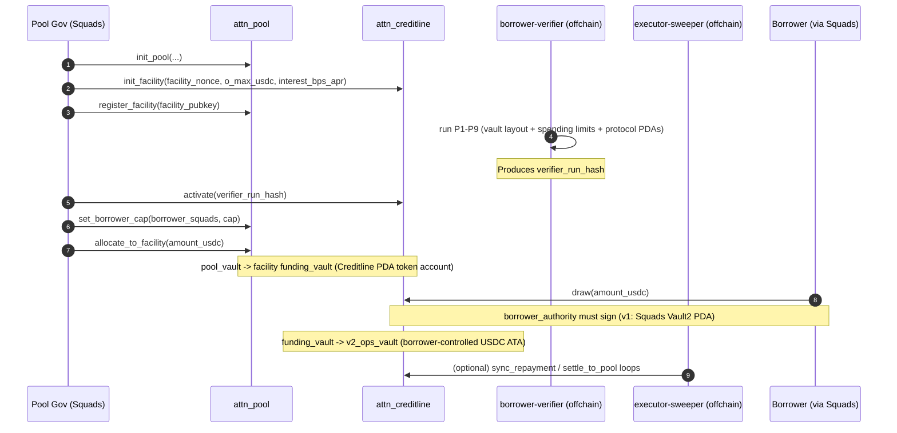
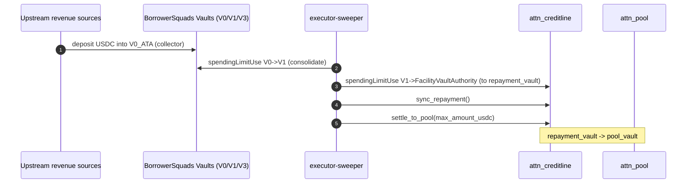

# attn-protocol v1: Program Map + Instruction Reference (Internal)

Status: internal notes (not external-facing).

Scope:
- What each onchain program does (`attn_pool`, `attn_creditline`)
- What each instruction does (what it checks + what it changes)
- How `attn-credit` (offchain control plane) interacts with the protocol

As of: 2026-02-14.

Repos in scope:
- Onchain: `/Users/user/PycharmProjects/attn-protocol`
- Offchain/control plane: `/Users/user/PycharmProjects/attn-credit`

---

## 0) TL;DR (mental model)

- `attn_pool` is the LP pool: deposits mint shares; withdraws are FIFO claims; pool governance can allocate liquidity to facilities; NAV is computed onchain from pool vault + all facilities (incl. unsynced repayment deltas).
- `attn_creditline` is the per-borrower facility: holds a funding vault and a repayment vault; borrower can draw into their ops vault; repayments are observed by `sync_repayment` and then physically moved to the pool by `settle_to_pool`.
- The protocol does **not** implement a “revenue account” primitive. Revenue control is implemented by the borrower’s **Squads v4** control plane + `attn-credit` invariants + monitoring.

---

## 1) Program IDs (hard-coupled)

These are hardcoded constants inside the programs; upgrades are expected to be in-place under the same IDs.

- `attn_pool` program id: `3aJrF1Cz3QEyGg2Rkc49tGneYU5gKAc1xJqj4tXyZkF8`
- `attn_creditline` program id: `EMJvM7roHTseTvKLz42jEpP9HgBK1CboGU5vKsDrZ6gx`

Cross-program ownership checks:
- `attn_creditline` requires `pool_state.owner == attn_pool_program_id`
- `attn_pool` requires `facility_state.owner == attn_creditline_program_id`

---

## 2) PDAs / seeds (addresses you must be able to derive)

### 2.1 Pool program PDAs (`attn_pool`)

- `pool_state`: `["pool_state", share_mint]`
- `pool_vault_authority`: `["pool_vault_authority", pool_state]`
- `facility_registry`: `["facility_registry", pool_state]`
- `borrower_cap`: `["borrower_cap", pool_state, borrower_squads]`
- `facility_impairment`: `["facility_impairment", pool_state, facility_pubkey]`
- `withdraw_claim`: `["withdraw", pool_state, seq_u64_le]`

### 2.2 Creditline program PDAs (`attn_creditline`)

- `facility_state`: `["facility", pool_state, borrower_squads, facility_nonce_u64_le]`
- `facility_vault_authority`: `["facility_vault_authority", facility_state]`
- `funding_vault`: `["funding_vault", facility_state]` (SPL token account, owned by `facility_vault_authority`)
- `repayment_vault`: `["repayment_vault", facility_state]` (SPL token account, owned by `facility_vault_authority`)

---

## 3) How the repos fit together (architecture + flows)

### 3.1 Components (conceptual)

### 3.2 Facility lifecycle sequence (create -> activate -> allocate -> draw)

### 3.3 Repayment sequence (pledged revenue -> protocol accounting -> settlement)

---

## 4) Program reference: `attn_creditline` (facility)

Primary job:
- hold per-facility state and vaults
- enforce draw throttles and status gating
- observe repayments via `sync_repayment`
- physically settle repayment cash into the pool via `settle_to_pool`

Key state:
- `FacilityState` (PDA account, seeded by pool + borrower squads + nonce)
- `FundingVault` (PDA token account)
- `RepaymentVault` (PDA token account)
- `FacilityVaultAuthority` (PDA authority owning both vault token accounts)

### Instructions

#### `init_facility(facility_nonce, o_max_usdc, interest_bps_apr)`

Authority:
- `pool_gov_authority` signer (must match `pool_state.pool_gov_authority`)

Creates:
- `facility_state` PDA account
- `funding_vault` PDA token account (owned by `facility_vault_authority`)
- `repayment_vault` PDA token account (owned by `facility_vault_authority`)

Pins:
- `borrower_squads` pubkey (stored, not validated onchain)
- `borrower_authority` pubkey (stored; signs `draw`)
- `v2_ops_vault` SPL token account (must be owned by `borrower_authority` and have mint==asset)

Sets defaults:
- status = `INACTIVE`
- `pledge_share_bps_min = 10000`, `residual_cap_usdc_per_day = 0`
- draw caps = 10% per-tx, 30% per-day of `o_max_usdc` (v1 helper functions)
- draw cooldown = 1800 seconds

#### `activate(verifier_run_hash)`

Authority:
- `pool_gov_authority` signer

Checks:
- facility is `INACTIVE`
- pool matches

Effects:
- writes `verifier_run_hash` into `facility_state`
- sets status to `ACTIVE`

Note:
- `attn_creditline` does not validate the hash contents; that is entirely offchain policy.

#### `set_params(o_max_usdc, interest_bps_apr, pledge_share_bps_min, residual_cap_usdc_per_day, draw_cap_per_tx_usdc, draw_cap_per_day_usdc, draw_cooldown_sec)`

Authority:
- `pool_gov_authority` signer

Checks:
- pool matches
- numeric invariants:
  - `pledge_share_bps_min <= 10000`
  - `draw_cap_per_tx_usdc <= draw_cap_per_day_usdc <= o_max_usdc`

Effects:
- updates facility terms (caps, interest, pledge floor, residual cap, draw throttles)

#### `draw(amount_usdc)`

Authority:
- `borrower_authority` signer (v1: expected to be Squads `Vault2` PDA)

Checks:
- facility status must be `ACTIVE` (fails if `FROZEN` or not active)
- mint and owner of:
  - `funding_vault` == asset mint; owner == `facility_vault_authority`
  - `v2_ops_vault` == asset mint; owner == `borrower_authority`
- throttles:
  - per-tx cap
  - per-day cap (rolling 24h window)
  - cooldown since last draw

Effects:
- CPI transfer: `funding_vault -> v2_ops_vault` signed by `facility_vault_authority`
- increments `outstanding_principal_usdc`
- updates draw window markers

#### `sync_repayment()`

Authority:
- permissionless (any signer `caller`)

Checks:
- `repayment_vault` mint matches
- `repayment_vault.owner` is the canonical `facility_vault_authority` PDA
- `repayment_vault.amount` must be >= last synced marker (no decreases)

Effects (accounting only):
- computes `delta = current_balance - last_sync_balance`
- applies delta to:
  - interest first (`accrued_interest_usdc`)
  - then principal (`outstanding_principal_usdc`)
- updates sync markers:
  - `repayment_vault_balance_last_sync_usdc`
  - `last_repayment_sync_ts`

#### `settle_to_pool(max_amount_usdc)`

Authority:
- permissionless (any signer `caller`)

Checks:
- pool matches facility
- `pool_vault` matches `pool_state.pool_vault`
- `repayment_vault` is fully synced:
  - `repayment_vault.amount == facility_state.repayment_vault_balance_last_sync_usdc`

Effects:
- CPI transfer: `repayment_vault -> pool_vault` signed by `facility_vault_authority`
- updates `repayment_vault_balance_last_sync_usdc` to post-transfer balance

#### `freeze(reason_code)` / `unfreeze()`

Authority:
- `pool_gov_authority` signer

Effects:
- `freeze`: `ACTIVE -> FROZEN` (not allowed if `DEFAULTED` or `ACCELERATED`)
- `unfreeze`: `FROZEN -> ACTIVE` (not allowed if `DEFAULTED` or `ACCELERATED`)

Operational intent:
- freeze is the primary “stop the bleeding” switch: it blocks `draw`.

#### `default_mode(reason_code)` / `accelerate(reason_code)`

Authority:
- `pool_gov_authority` signer

Effects:
- sets facility status to `DEFAULTED` or `ACCELERATED`

Note:
- these currently do not enforce a prior-status transition graph; they just set the status.

---

## 5) Program reference: `attn_pool` (LP pool)

Primary job:
- track LP deposits via share minting
- track withdrawals via a FIFO claim queue
- track facility exposure and compute onchain NAV
- allow pool governance to allocate USDC to facilities under caps

Key state:
- `PoolState` (PDA, seeded by share mint)
- `ShareMint` (share issuance controlled by `PoolState` PDA)
- `PoolVault` (USDC token account owned by `PoolVaultAuthority` PDA)
- `FacilityRegistry` (list of facilities, max 16)
- `BorrowerCap` (per borrower squads cap)
- `FacilityImpairment` (per facility impairment write-down)
- `WithdrawClaim` (per-withdraw request account, FIFO by seq)

### Instructions

#### `init_pool(asset_mint, share_mint_decimals, cap_pool_total_usdc, liquidity_buffer_bps)`

Authority:
- `pool_gov_authority` signer

Creates:
- `share_mint` (decimals fixed at 6 in v1)
- `pool_state` PDA
- `pool_vault_authority` PDA
- `pool_vault` token account (owned by `pool_vault_authority`)
- `facility_registry` PDA

Notes:
- pool tag is set to a constant (`PUMPv1`).

#### `deposit(amount_usdc, min_shares_out)`

Authority:
- permissionless (depositor signs)

Checks:
- pool is not paused
- facility registry is present

NAV:
- calls `compute_net_assets_usdc(...)` which requires **remaining accounts**:
  - for each facility in registry: `facility_state`, `funding_vault`, `repayment_vault`
- NAV math includes:
  - pool_vault balance
  - facility funding + repayment vault balances
  - outstanding principal + accrued interest (with virtual accrual to `now_ts`)
  - unsynced repayment deltas (allowed only if repayment vault increased vs last sync)
  - minus impairments
  - minus withdraw liability remaining

Effects:
- transfers USDC `depositor_asset_ata -> pool_vault`
- mints pool shares to `depositor_share_ata` with `PoolState` PDA as the controlling signer for issuance

#### `request_withdraw(shares_in, min_amount_out_usdc)`

Authority:
- permissionless (share owner signs)

NAV:
- same NAV computation as deposit (requires remaining facility accounts)

Effects:
- burns `shares_in` from owner share ATA
- creates `withdraw_claim` PDA at current `withdraw_seq_next`
- increments `withdraw_seq_next`
- increases `withdraw_liability_remaining_usdc` by amount owed

#### `claim_withdraw(seq, max_amount_usdc)`

Authority:
- permissionless (claimer signs)

Checks:
- `seq` must equal `pool_state.withdraw_seq_head` (FIFO enforcement)

Effects:
- pays out up to:
  - `max_amount_usdc`
  - remaining owed on claim
  - pool_vault available balance
- updates claim + reduces pool withdraw liability
- if fully paid:
  - increments `withdraw_seq_head`
  - closes the claim account (rent refunded to the withdraw owner)

#### `pause_pool()` / `unpause_pool()`

Authority:
- `pool_gov_authority` signer

Effects:
- toggles `pool_state.paused` (blocks `deposit`, but does not directly block claim_withdraw)

#### `register_facility(facility_pubkey)`

Authority:
- `pool_gov_authority` signer

Checks:
- facility account is owned by `attn_creditline`
- facility’s `pool` and `asset_mint` match

Effects:
- inserts the facility into `facility_registry` (max 16)

#### `set_pool_caps(cap_pool_total_usdc, liquidity_buffer_bps)`

Authority:
- `pool_gov_authority` signer

Effects:
- updates pool caps/buffer config

#### `set_borrower_cap(borrower_squads, cap_borrower_total_usdc)`

Authority:
- `pool_gov_authority` signer

Effects:
- creates/updates the `BorrowerCap` PDA for `(pool_state, borrower_squads)`

#### `allocate_to_facility(amount_usdc)`

Authority:
- `pool_gov_authority` signer

Goal:
- move USDC from `pool_vault -> facility_funding_vault` under cap checks

Checks:
- share supply must be non-zero (pool initialized)
- facility must be in registry
- facility funding vault authority must be the canonical `attn_creditline::FacilityVaultAuthority`
- `BorrowerCap` PDA must correspond to facility borrower_squads
- cap checks:
  - facility cap (`o_max_usdc`)
  - borrower cap (sum exposure across borrower’s facilities)
  - pool cap (sum exposure across all facilities)

Effects:
- CPI transfer: `pool_vault -> facility_funding_vault` signed by `PoolVaultAuthority`

#### `set_facility_impairment(facility, impairment_usdc, reason_code)`

Authority:
- `pool_gov_authority` signer

Checks:
- facility is in registry (governance footgun hardening)

Effects:
- creates/updates impairment PDA
- updates pool aggregate `impairments_usdc` by delta

---

## 6) Where `attn-credit` touches the protocol (practically)

`attn-credit` is the “control plane”:

- Pins protocol ABI via vendored IDLs and checksums.
- Runs borrower invariants (control-plane shape + spending limits).
- Monitors “weakening changes” over time and can recommend governance actions.
- Executes the automated waterfall:
  - spending-limit transfers between Squads vault ATAs (V0/V1/V3)
  - repayment transfer into `attn_creditline` repayment vault (destination authority = `FacilityVaultAuthority`)
  - `sync_repayment` and `settle_to_pool` calls

If you’re debugging end-to-end, treat this as the core contract:

1) Protocol does accounting + vault custody.
2) Offchain enforces revenue routing assumptions via Squads invariants, and drives the repayment cadence.
